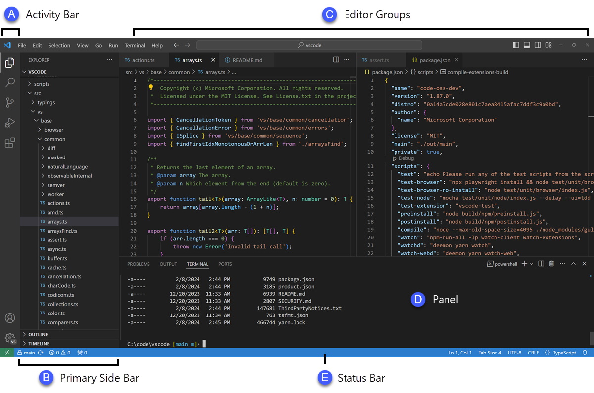
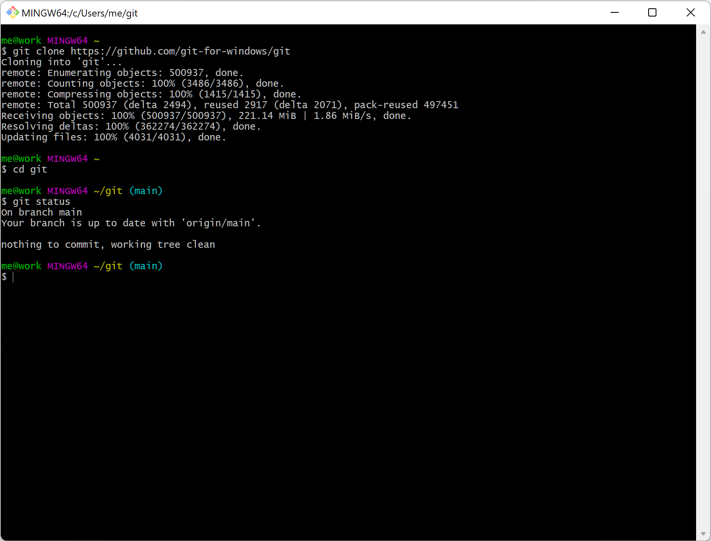

# Aula 1: IDE e Terminal
Prof. Gustavo Clay

---

## Objetivos da Aula

1. Apresentar o **VS Code** como IDE principal.
2. Introduzir o **Git Bash** como terminal no Windows.
3. Ensinar comandos básicos do terminal.
4. Configurar o ambiente de desenvolvimento.

---

## O que é um IDE?

- **IDE** (Integrated Development Environment): Ambiente de desenvolvimento integrado.
- Ferramenta que auxilia na escrita, depuração e execução de código.
- Exemplos: VS Code, IntelliJ, Eclipse.

---

## VS Code

- **Visual Studio Code**: Editor de código leve e poderoso.
- Desenvolvido pela Microsoft.
- Suporta extensões para diversas linguagens e frameworks.

---

---

### Principais Recursos

1. **IntelliSense**: Autocompletar de código.
2. **Debugging**: Depuração integrada.
3. **Extensões**: Amplie funcionalidades (React Native, Git, etc.).
4. **Terminal Integrado**: Execute comandos diretamente no editor.

---

## Instalando o VS Code

1. Acesse [code.visualstudio.com](https://code.visualstudio.com/).
2. Baixe a versão para o seu sistema operacional.
3. Siga o assistente de instalação.

---

## Git Bash

- **Git Bash**: Terminal para Windows que emula um ambiente Unix.
- Permite executar comandos do Git e do terminal Linux.

---

---

### Por que usar Git Bash?

1. **Compatibilidade**: Comandos Unix funcionam no Windows.
2. **Integração com Git**: Facilita o versionamento de código.
3. **Familiaridade**: Prepara para ambientes Linux/macOS.

---

## Instalando o Git Bash

1. Baixe o Git em [git-scm.com](https://git-scm.com/).
2. Siga o assistente de instalação.
3. Durante a instalação, selecione **Git Bash** como terminal padrão.

---

# Comandos Básicos do Terminal

---

### Navegação

- `pwd`: Mostra o diretório atual.
- `ls`: Lista arquivos e pastas no diretório atual.
- `cd <pasta>`: Navega até uma pasta.
  - Exemplo: `cd Documents`
- `cd ..`: Volta para a pasta anterior.

---

### Manipulação de Arquivos

- `touch <arquivo>`: Cria um arquivo vazio.
  - Exemplo: `touch index.html`
- `mkdir <pasta>`: Cria uma nova pasta.
  - Exemplo: `mkdir projetos`
- `rm <arquivo>`: Remove um arquivo.
  - Exemplo: `rm arquivo.txt`
- `rm -r <pasta>`: Remove uma pasta e seu conteúdo.
  - Exemplo: `rm -r projetos`

---

### Outros Comandos Úteis

- `clear`: Limpa o terminal.
- `code .`: Abre o VS Code no diretório atual.
- `cat <arquivo>`: Exibe o conteúdo de um arquivo.
