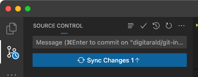

# Aula 2: Git e GitHub

Prof. Gustavo Clay

---

## Objetivos da Aula

1. Entender o que é **Git** e para que serve.
2. Aprender comandos básicos do Git.
3. Conhecer o **GitHub** e suas funcionalidades.
4. Criar uma conta no GitHub.

---

## O que é Git?

- **Git**: Sistema de controle de versão distribuído.
- Rastreia mudanças em arquivos ao longo do tempo.
- Permite trabalhar em equipe de forma organizada.

---

### Conceitos Básicos do Git

1. **Repositório**: Local onde o histórico de versões do projeto é armazenado.
2. **Commit**: Registro de uma alteração no repositório.
3. **Branch**: Ramificação do projeto para desenvolvimento paralelo.
4. **Merge**: Combinação de diferentes branches.

---

### Conceitos Básicos do Git

5. **Clone**: Cópia de um repositório remoto para local.
6. **Pull**: Atualização do repositório local com mudanças do repositório remoto.
7. **Push**: Envio de mudanças do repositório local para o repositório remoto.

---

## Comandos Básicos do Git

1. Inicializar um repositório:

   ```bash
   git init
   ```

2. Adicionar arquivos ao repositório:

   ```bash
   git add <arquivo>
   ```

3. Fazer um commit:

   ```bash
   git commit -m "Mensagem do commit"
   ```

---

4. Verificar o status do repositório:

   ```bash
   git status
   ```

5. Ver o histórico de commits:

   ```bash
   git log
   ```

6. Criar uma nova branch:

   ```bash
   git branch <nome-da-branch>
   ```

---

7. Mudar para uma branch:

   ```bash
   git checkout <nome-da-branch>
   ```

8. Unir uma branch ao branch atual:

   ```bash
   git merge <nome-da-branch>
   ```

---

## O que é GitHub?

- **GitHub**: Plataforma de hospedagem de código-fonte com controle de versão usando Git.
- Facilita a colaboração e o compartilhamento de projetos.

---

### Funcionalidades do GitHub

1. **Repositórios**: Armazene e organize seus projetos.
2. **Issues**: Gerencie tarefas, bugs e melhorias.
3. **Pull Requests**: Proponha mudanças e revise código.
4. **Actions**: Automatize fluxos de trabalho de desenvolvimento.
5. **Wikis**: Documente seu projeto.

---

## Criando uma Conta no GitHub

1. Acesse [github.com](https://github.com/).
2. Clique em "Sign up".
3. Preencha os campos com suas informações:
   - Username
   - Email
   - Password
4. Verifique seu email para confirmar a conta.
5. Complete o setup inicial (opcional).

---

## Criando um Repositório no GitHub

1. Após fazer login, clique em "New repository".
2. Preencha os campos:
   - Repository name
   - Description (opcional)
   - Public ou Private
3. Clique em "Create repository".

---

## Conectando Repositório Local ao GitHub

1. No terminal, adicione o repositório remoto:

   ```bash
   git remote add origin https://github.com/seuusuario/nomedorepositorio.git
   ```

2. Envie os commits locais para o GitHub:

   ```bash
   git push -u origin main
   ```

---

## Clonando um Repositório do GitHub

1. Copie o link do repositório no GitHub.
2. No terminal, clone o repositório:

   ```bash
   git clone https://github.com/seuusuario/nomedorepositorio.git
   ```

---

## Gitignore

- Arquivo que especifica quais arquivos e pastas devem ser ignorados pelo Git.
- Crie um arquivo `.gitignore` na raiz do projeto.
- Adicione os nomes dos arquivos e pastas a serem ignorados.
- Exemplo de `.gitignore`:

  ```plaintext
  node_modules/
  .DS_Store
  ```
---

## Gitignore.io

- Ferramenta online para gerar arquivos `.gitignore`.
- Acesse [gitignore.io](https://www.gitignore.io/).
- Digite o nome das tecnologias a serem ignoradas.
- Copie o conteúdo gerado para o arquivo `.gitignore`.

---

## Controle de Versão no VS Code

- O Visual Studio Code possui integração com o Git.
- Utilize a barra lateral para visualizar mudanças.
- Faça commits e push diretamente do VS Code.

---

## Inicializando um Repositório no VS Code

1. Abra o VS Code.
2. Clique em "Source Control" na barra lateral.
3. Clique em "Initialize Repository".
4. Adicione arquivos ao repositório.
5. Faça commits e push diretamente do VS Code.

---


---

## Clonando um Repositório no VS Code

1. Abra o VS Code.
2. Clique em "Source Control" na barra lateral.
3. Clique em "Clone Repository".
4. Cole o link do repositório e selecione a pasta de destino.

---


---


---

## Fazendo um Commit no VS Code

1. Abra o VS Code.
2. Clique em "Source Control" na barra lateral.
3. Adicione os arquivos ao commit.
4. Digite uma mensagem de commit e clique em "✓".

---


---

## Enviando Mudanças para o GitHub

1. Após fazer um commit, clique em "Push" na barra lateral.
2. Selecione o repositório remoto e clique em "Push".



---

<!-- _footer: '' -->


---

Referências:

- <https://code.visualstudio.com/docs/sourcecontrol/overview>
- <https://code.visualstudio.com/docs/sourcecontrol/intro-to-git>