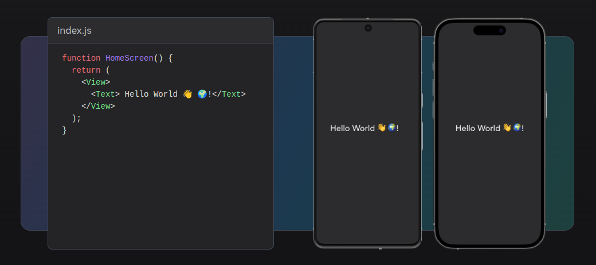

# Aula 4: Introdução ao React Native

Prof. Gustavo Clay

---

## Objetivos da Aula

1. Entender o que é **React**.
2. Entender o que é **React Native**.
3. Conhecer o **Expo** e suas funcionalidades.
4. Criar um projeto inicial com Expo.
5. Executar o projeto em um dispositivo ou emulador.

---

## O que é React?

- **React**: Biblioteca JavaScript para construção de interfaces de usuário.
- Desenvolvida pelo Facebook e lançada em 2013.
- Baseada em componentes reutilizáveis.
- Utiliza um DOM virtual para otimizar atualizações de interface.

---

## Elementos do React

1. **JSX**: Sintaxe para escrever componentes.
2. **Componentes**: Blocos de construção da interface.
3. **Props**: Propriedades passadas para os componentes.
4. **State**: Dados internos do componente.
5. **Hooks (Ciclo de Vida)**: Métodos executados em diferentes fases do componente.

---


## O que é React Native?

- **React Native**: Framework para desenvolvimento de aplicativos móveis.
- Permite criar aplicativos para iOS e Android usando JavaScript e React.
- Desenvolvido pelo Facebook e lançado em 2015.

---
## O que é React Native?



---

### Vantagens do React Native

1. **Código compartilhado**: Escreva uma vez, execute em iOS e Android.
2. **Desempenho nativo**: Componentes nativos para melhor desempenho.
3. **Comunidade ativa**: Grande quantidade de bibliotecas e suporte.
4. **Hot Reloading**: Atualizações instantâneas durante o desenvolvimento.

---

## O que é Expo?

- **Expo**: Plataforma para desenvolvimento de aplicativos React Native.
- Facilita a criação, execução e publicação de aplicativos.
- Inclui ferramentas e serviços para desenvolvimento rápido.

---

### Funcionalidades do Expo

1. **Expo CLI**: Ferramenta de linha de comando para gerenciar projetos.
2. **Expo Go**: Aplicativo para visualizar projetos em dispositivos reais.
3. **Expo SDK**: Conjunto de APIs e componentes prontos para uso.
4. **Expo Snack**: Editor online para experimentar código React Native.

---

## Instalando o Expo CLI

1. Certifique-se de ter o Node.js instalado.
2. No terminal, execute o comando:
   ```bash
   npm install -g expo-cli
   ```

---

## Criando um Projeto com Expo

1. No terminal, execute o comando:
   ```bash
   expo init meu-projeto
   ```
2. Escolha o template "blank" (em branco).
3. Navegue até o diretório do projeto:
   ```bash
   cd meu-projeto
   ```

---

## Estrutura do Projeto

- **App.js**: Arquivo principal do aplicativo.
- **assets/**: Pasta para recursos como imagens e fontes.
- **node_modules/**: Dependências do projeto.
- **package.json**: Arquivo de configuração do projeto.

---

## Executando o Projeto

1. No terminal, execute o comando:
   ```bash
   expo start
   ```
2. Escaneie o QR code com o aplicativo **Expo Go** no seu dispositivo.
3. Ou escolha a opção para executar em um emulador (iOS ou Android).

---

## Código Inicial do App.js

```javascript
import React from 'react';
import { StyleSheet, Text, View } from 'react-native';

export default function App() {
  return (
    <View style={styles.container}>
      <Text>Olá, React Native!</Text>
    </View>
  );
}

const styles = StyleSheet.create({
  container: {
    flex: 1,
    backgroundColor: '#fff',
    alignItems: 'center',
    justifyContent: 'center',
  },
});
```

---

## Personalizando o Projeto

1. **Alterar o texto**: Modifique o texto dentro do componente `<Text>`.
2. **Adicionar estilos**: Adicione ou modifique estilos no objeto `styles`.
3. **Adicionar componentes**: Utilize componentes como `<Button>`, `<Image>`, `<TextInput>`, etc.

---

## Exercícios

1. Crie um novo projeto Expo e altere o texto para "Bem-vindo ao React Native!".
2. Adicione um botão ao projeto e exiba um alerta quando o botão for pressionado.
3. Adicione uma imagem ao projeto e exiba-a na tela.
4. Crie um componente personalizado e utilize-o no projeto.

---

