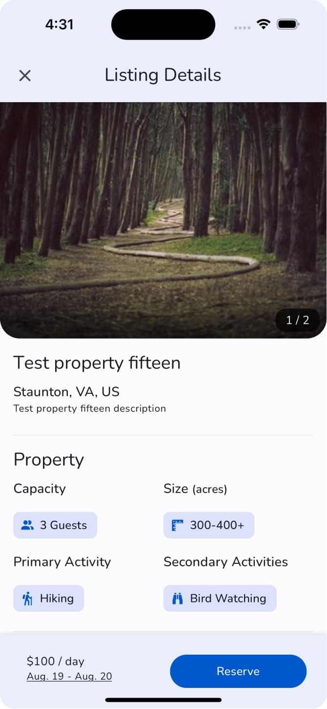

# Aula 5: Fundamentos do React Native

Prof. Gustavo Clay

---

## Básico de Componentes

- Componentes são blocos de construção da interface do usuário.
- Funcionam como funções que retornam elementos visuais (JSX).
- Componentes podem ser reutilizáveis e independentes.

---
<!-- _header: '' -->
<!-- _footer: '' -->




---

Exemplo de Componente:
```jsx
import React from 'react';
import { Text, View } from 'react-native';

export default function MeuComponente() {
  return (
    <View>
      <Text>Olá, Mundo!</Text>
    </View>
  );
};

```

---

Exemplo de Componente:
```jsx
const HelloComponente = () => {
  return (
    <View>
      <Text>Olá, Mundo!</Text>
    </View>
  );
};

export default HelloComponente;

```

---

Exemplo de Componente:
```jsx
const Saudacao = () => <Text>Olá, Mundo!</Text>;

export default Saudacao;

```

---

## Retorno de Uma Linha no JSX

- Quando o componente retorna apenas um elemento, pode-se usar uma única linha.

Exemplo:
```jsx
const Saudacao = () => <Text>Olá, Mundo!</Text>;

export default Saudacao;
```

---

<!-- _footer: '' -->

## Retorno de Múltiplas Linhas no JSX

- Quando o componente retorna múltiplos elementos, deve-se usar parênteses para envolver o retorno.
- Note que o uso de parênteses torna o código mais legível e organizado.

Exemplo:
```jsx
const MeuComponente = () => {
  return (
    <View>
      <Text>Olá, Mundo!</Text>
      <Text>Bem-vindo ao React Native!</Text>
    </View>
  );
};

export default MeuComponente;
```

---

## Utilizando Código JavaScript dentro do JSX

- Você pode utilizar expressões JavaScript dentro do JSX.
- Para isso, basta envolver o código JavaScript com chaves `{}`.

Exemplo:
```jsx
const Saudacao = () => {
  const nome = 'Gustavo';
  return <Text>Olá, {nome}!</Text>;
};

export default Saudacao;
```

---

## Condicionais no JSX

- Você pode usar condicionais dentro do JSX utilizando operadores ternários.

Exemplo:
```jsx
const Saudacao = () => {
  const usuarioLogado = true;
  return (
    <Text>
      {usuarioLogado ? 'Bem-vindo de volta!' : 'Por favor, faça login.'}
    </Text>
  );
};

export default Saudacao;
```
---

## Loops no JSX

- Você pode usar loops para renderizar listas de elementos.

Exemplo:
```jsx
const ListaDeItens = () => {
  const lista = ['Item 1', 'Item 2', 'Item 3'];
  return (
    <View>
      {lista.map((item, index) => (
        <Text key={index}>{item}</Text>
      ))}
    </View>
  );
};

// Uso do componente
<ListaDeItens />
```

---

## Funções no JSX

- Você pode chamar funções dentro do JSX para realizar operações ou renderizar elementos dinamicamente.

Exemplo:
```jsx
const Saudacao = () => {
  const obterMensagem = () => {
    return 'Olá, Mundo!';
  };

  return <Text>{obterMensagem()}</Text>;
};

export default Saudacao;
```

---

## Propriedades dos Componentes

- Propriedades (props) são usadas para passar dados para componentes.
- Props são imutáveis.

Exemplo:
```jsx
const Saudacao = (props) => {
  return <Text>Olá, {props.nome}!</Text>;
};

// Uso do componente
<Saudacao nome="Gustavo" />
```

---

## Criação de Componentes Personalizados

- Componentes personalizados são componentes que você cria para reutilizar código.

Exemplo:
```jsx
const MeuBotao = (props) => {
  return (
    <Button
      title={props.title}
      onPress={props.onPress}
    />
  );
};

// Uso do componente
<MeuBotao title="Clique Aqui" onPress={() => alert('Botão clicado!')} />
```

---

## Componente Pai e Filho

- Componentes podem conter outros componentes (composição).
- O componente pai passa dados para o componente filho via props.
- O componente filho pode chamar funções do componente pai via callbacks.
- A comunicação entre componentes pode ser direta ou indireta.

---

## Composição de Componentes

Exemplo:
```jsx
const Pai = (props) => {
  return (
    <View>
    <Text>Componente Pai</Text>
      <Filho nome="Filho 1" />
      <Filho nome="Filho 2" />
    </View>
  );
};

const Filho = (props) => <Text>{props.nome}</Text>

```

---

## Comunicação Direta

- Comunicação direta: Pai para Filho via props.

Exemplo de Comunicação Direta:
```jsx
const Pai = () => {
  return (
    <View>
      <Filho mensagem="Mensagem do Pai" />
    </View>
  );
};

const Filho = (props) => {
  return <Text>{props.mensagem}</Text>;
};
```

---

## Comunicação Indireta

- Comunicação indireta: Filho para Pai via callbacks.

Exemplo de Comunicação Indireta:

---

<!-- _footer: '' -->

```jsx
const Pai = () => {
  const receberMensagem = (msg) => {
    alert(msg);
  };

  return (
    <View>
      <Filho enviarMensagem={receberMensagem} />
    </View>
  );
};

const Filho = (props) => {
  return (
    <Button
      title="Enviar Mensagem"
      onPress={() => props.enviarMensagem('Mensagem do Filho')}
    />
  );
};
```

---

<!-- _footer: '' -->

## Propriedade `children`

- A propriedade `children` é usada para passar elementos filhos para um componente.
- Permite que componentes aninhem outros componentes ou elementos.

Exemplo:
```jsx
const Container = (props) => {
  return <View>{props.children}</View>;
};

// Uso do componente
<Container>
  <Text>Este é um texto dentro do Container.</Text>
</Container>
```
